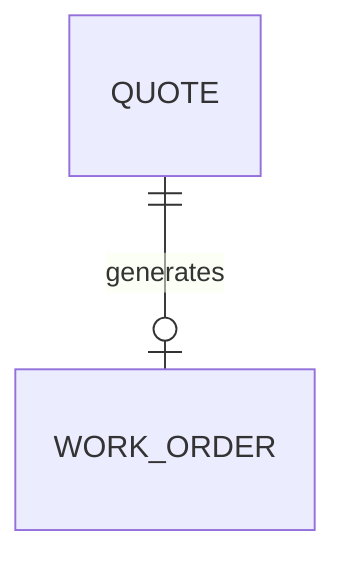

# ADR-0001: Cardinalidad Cotización → Orden de Trabajo (`QUOTE` → `WORK_ORDER`)

**Estado:** Aceptada
**Fecha:** 2026-09-03
**Deciders:** Backend

## Contexto

Al modelar la relación entre `QUOTE` y `WORK_ORDER`, una primera versión
del ERD las vinculaba como 1 a 1 obligatorio en ambos sentidos
(`||--||`). Sin embargo, según el flujo de negocio del proyecto
(Solicitud → Cotización → Aprobación → OT), una cotización puede existir
en estado `pending_approval` sin haber generado todavía una Orden de
Trabajo.

## Decisión

La relación es 1 a (0 o 1): una `QUOTE` puede tener cero o una
`WORK_ORDER` asociada.

## Opciones consideradas

### Opción A: 1 a 1 obligatorio (`||--||`)

| Dimensión                          | Evaluación                                 |
| ---------------------------------- | ------------------------------------------ |
| Simplicidad del modelo             | Alta                                       |
| Fidelidad al flujo de negocio real | Baja — no permite cotizaciones sin aprobar |

**Pros:** modelo más simple de leer a primera vista.
**Cons:** obliga a crear una `WORK_ORDER` "vacía" en el momento de
cotizar, lo cual contradice el flujo de aprobación real.

### Opción B: 1 a (0 o 1) (`||--o|`) — elegida

| Dimensión                          | Evaluación                                                                 |
| ---------------------------------- | -------------------------------------------------------------------------- |
| Simplicidad del modelo             | Alta                                                                       |
| Fidelidad al flujo de negocio real | Correcta — refleja que la aprobación es un paso posterior y no garantizado |

**Pros:** modela fielmente que no toda cotización se aprueba.
**Cons:** el código debe manejar explícitamente el caso en que la
`WORK_ORDER` todavía no existe.

## Consecuencias

- El campo `quote_id` en `WORK_ORDER` sigue siendo obligatorio (una OT
  siempre nace de una cotización), pero no toda `QUOTE` tiene una
  `WORK_ORDER`.
- Cualquier query o endpoint que asuma "toda cotización tiene una OT" está
  mal — hay que manejar explícitamente el caso `null`.
- El estado `pending_approval` de una `QUOTE` debe ser consultable sin
  depender de que exista una `WORK_ORDER` asociada.

## Action Items

1. [ ] Validar este modelo con el resto del equipo en la reunión de
       Semana 1.
2. [ ] Definir la máquina de estados completa de la OT (transiciones
       válidas) — ver `docs/architecture.md`.
3. [ ] Crear ADR-0002 cuando se decida el motor de base de datos.
