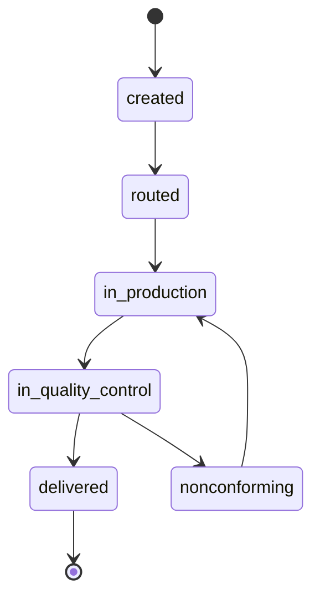

# ADR-0002: Una OT no conforme vuelve a producción, no genera una OT nueva

**Estado:** Aceptada
**Fecha:** 2026-09-04
**Deciders:** Backend (validar con Calidad y Planta en Semana 1)

## Contexto

Cuando `QUALITY_CONTROL` marca una pieza como no conforme
(`WORK_ORDER.status = nonconforming`), hay que decidir cómo continúa el
ciclo: ¿la misma `WORK_ORDER` vuelve a producción para reprocesarse, o se
cierra esa OT y se genera una nueva para la pieza corregida?

## Decisión

`nonconforming` transiciona de vuelta a `in_production` sobre la misma
`WORK_ORDER`. No se crea una OT nueva.

## Opciones consideradas

### Opción A: Nueva OT por cada reproceso

| Dimensión                        | Evaluación                                      |
| -------------------------------- | ----------------------------------------------- |
| Simplicidad del ciclo de estados | Alta — cada OT es un intento lineal, sin ciclos |
| Fidelidad al criterio de éxito   | Baja                                            |

**Pros:** cada OT representa un intento de producción limpio y fácil de
leer de punta a punta.
**Cons:** fragmenta la trazabilidad de una misma pieza física en varios
expedientes — contradice directamente el criterio de éxito del proyecto
(reconstruir el historial completo de un trabajo desde una sola
pantalla). También complica la relación con `QUOTE`, que según ADR-0001
genera como máximo una `WORK_ORDER`.

### Opción B: Misma OT vuelve a producción — elegida

| Dimensión                        | Evaluación                                            |
| -------------------------------- | ----------------------------------------------------- |
| Simplicidad del ciclo de estados | Media — requiere modelar un ciclo, no un flujo lineal |
| Fidelidad al criterio de éxito   | Alta                                                  |

**Pros:**

- El expediente único (`GET /work-orders/:id/dossier`) sigue mostrando
  todo el historial de la pieza en un solo lugar, no conformidad y
  corrección incluidas — exactamente lo que pide el criterio de éxito.
- `STATUS_HISTORY` ya es append-only, así que soporta ciclos repetidos
  sin cambios de esquema.
- `QUALITY_CONTROL` ya tiene cardinalidad 1 a muchos con `WORK_ORDER`
  desde el ERD original — ya admitía varios registros de inspección por
  OT antes de que esta decisión existiera formalmente.

**Cons:** el código de transición de estados debe permitir
explícitamente el ciclo `in_quality_control → nonconforming →
in_production`, en vez de validar un flujo estrictamente lineal.

## Consecuencias

- La máquina de estados de `WORK_ORDER` deja de ser lineal: tiene un
  ciclo válido entre `in_production` y `in_quality_control` /
  `nonconforming`.
- Cada vuelta por el ciclo genera un nuevo registro en `QUALITY_CONTROL`
  y en `STATUS_HISTORY` — nunca se sobrescribe el anterior.
- El endpoint `GET /work-orders/:id/dossier` debe mostrar el historial
  completo de inspecciones, no solo la más reciente.

## Action Items

1. [ ] Validar con Calidad y Planta que reprocesar sobre la misma OT es
       operativamente correcto (por ejemplo, si en la práctica alguna
       vez se necesita refabricar la pieza desde cero con una OT nueva).
2. [ ] Definir si conviene un límite de ciclos de reproceso para el MVP,
       o si queda sin límite por ahora.
