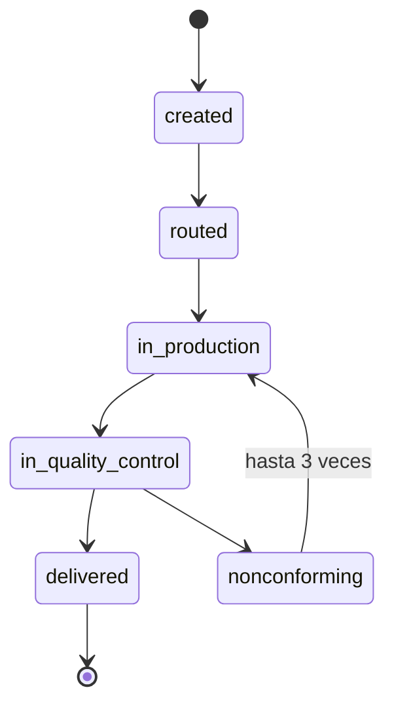

# ADR-0002: Una OT no conforme vuelve a producción, no genera una OT nueva

**Estado:** Aceptada
**Fecha:** 2026-09-04
**Deciders:** Team

## Contexto

Cuando `QUALITY_CONTROL` marca una pieza como no conforme
(`WORK_ORDER.status = nonconforming`), hay que decidir cómo continúa el
ciclo: ¿la misma `WORK_ORDER` vuelve a producción para reprocesarse, o se
cierra esa OT y se genera una nueva para la pieza corregida?

## Decisión

`nonconforming` transiciona de vuelta a `in_production` sobre la misma
`WORK_ORDER`. No se crea una OT nueva.

El ciclo de reproceso tiene un límite de **3 vueltas** sobre la misma
OT: una pieza puede pasar por control de calidad y volver a producción
hasta 3 veces. A partir de la cuarta no conformidad, la OT no vuelve a
producción — se cierra el ciclo y hay que crear una `WORK_ORDER` nueva
para refabricar la pieza desde cero. El límite se valida en el código
de transición de estados (contando las filas de `STATUS_HISTORY` con
`new_status = nonconforming` para esa OT); la transición
`nonconforming → in_production` se rechaza si ya hubo 3.

> El ciclo `in_production ↔ in_quality_control / nonconforming` admite
> como máximo 3 vueltas sobre la misma OT. A partir de ahí se requiere
> una `WORK_ORDER` nueva.

## Opciones consideradas

### Opción A: Nueva OT por cada reproceso

| Dimensión                        | Evaluación                                      |
| -------------------------------- | ----------------------------------------------- |
| Simplicidad del ciclo de estados | Alta — cada OT es un intento lineal, sin ciclos |
| Fidelidad al criterio de éxito   | Baja                                            |

**Pros:** cada OT representa un intento de producción limpio y fácil de
leer de punta a punta.
**Cons:** fragmenta la trazabilidad de una misma pieza física en varios
expedientes — contradice directamente el criterio de éxito del proyecto
(reconstruir el historial completo de un trabajo desde una sola
pantalla). También complica la relación con `QUOTE`, que según ADR-0001
genera como máximo una `WORK_ORDER`.

### Opción B: Misma OT vuelve a producción — elegida

| Dimensión                        | Evaluación                                            |
| -------------------------------- | ----------------------------------------------------- |
| Simplicidad del ciclo de estados | Media — requiere modelar un ciclo, no un flujo lineal |
| Fidelidad al criterio de éxito   | Alta                                                  |

**Pros:**

- El expediente único (`GET /work-orders/:id/dossier`) sigue mostrando
  todo el historial de la pieza en un solo lugar, no conformidad y
  corrección incluidas — exactamente lo que pide el criterio de éxito.
- `STATUS_HISTORY` ya es append-only, así que soporta ciclos repetidos
  sin cambios de esquema.
- `QUALITY_CONTROL` ya tiene cardinalidad 1 a muchos con `WORK_ORDER`
  desde el ERD original — ya admitía varios registros de inspección por
  OT antes de que esta decisión existiera formalmente.

**Cons:** el código de transición de estados debe permitir
explícitamente el ciclo `in_quality_control → nonconforming →
in_production`, en vez de validar un flujo estrictamente lineal, y
además contar las vueltas ya dadas para cortar en 3.

## Consecuencias

- La máquina de estados de `WORK_ORDER` deja de ser lineal: tiene un
  ciclo válido entre `in_production` y `in_quality_control` /
  `nonconforming`.
- Cada vuelta por el ciclo genera un nuevo registro en `QUALITY_CONTROL`
  y en `STATUS_HISTORY` — nunca se sobrescribe el anterior.
- El endpoint `GET /work-orders/:id/dossier` debe mostrar el historial
  completo de inspecciones, no solo la más reciente.
- El ciclo de reproceso está acotado a 3 vueltas por OT. La cuarta no
  conformidad no habilita `nonconforming → in_production`: la pieza se
  refabrica en una `WORK_ORDER` nueva. El conteo se deriva de
  `STATUS_HISTORY` (filas con `new_status = nonconforming` para esa OT),
  no de un contador redundante en `WORK_ORDER`.

## Action Items

1. [x] Validar con Calidad y Planta que reprocesar sobre la misma OT es
       operativamente correcto — confirmado. Hasta 3 reprocesos se
       hacen sobre la misma OT; a partir de la cuarta no conformidad se
       refabrica la pieza desde cero con una `WORK_ORDER` nueva.
2. [x] Definir si conviene un límite de ciclos de reproceso para el MVP
       — sí: 3 vueltas por OT. La transición `nonconforming →
 in_production` se rechaza si ya hubo 3 registros `nonconforming`
       en `STATUS_HISTORY` para esa OT.
