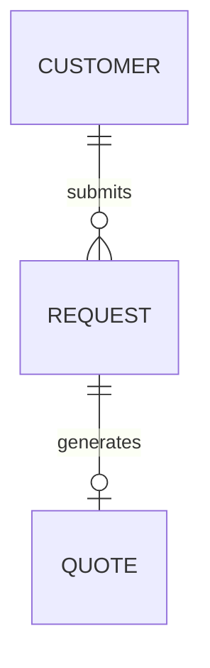

# ADR-0003: REQUEST como entidad propia, separada de QUOTE

**Estado:** Aceptada
**Fecha:** 2026-09-04
**Deciders:** Backend (a partir del análisis de criterios de aceptación de QA)

## Contexto

Los criterios de aceptación preliminares del MVP, redactados por QA de
forma independiente, tratan "solicitud" como un registro con identidad
propia: se crea, se identifica de forma única, se consulta por separado,
y la cotización se asocia _a la solicitud_ (no directo al cliente). El
ERD original no tenía esa entidad — `QUOTE` colgaba directo de
`CUSTOMER`. El brief original del proyecto también lista "Solicitud del
cliente" como paso propio del flujo de negocio, separado de
"Cotización".

## Decisión

Se agrega `REQUEST` como entidad propia:
`CUSTOMER` → `REQUEST` → `QUOTE` → `WORK_ORDER`.

## Opciones consideradas

### Opción A: Solicitud como estado inicial de QUOTE (ej. `status = requested`)

**Pros:** sin tabla nueva, sin join adicional — coherente con el
criterio de minimalismo usado en otras decisiones (ej. no separar Planta
en Jefe de Planta / Operario).
**Cons:** si más adelante se edita el borrador de la cotización, se
pierde el registro de cuál fue el pedido original del cliente antes de
que Comercial lo tradujera en precio. Además, `amount` tendría que
volverse nullable para representar el estado sin precio todavía —
mezclando semánticas distintas en una sola columna.

### Opción B: REQUEST como entidad propia — elegida

**Pros:**

- Preserva el pedido original del cliente como un registro inmutable,
  independiente de cómo evoluciona la cotización — coherente con el
  mismo principio de trazabilidad que ya justifica que
  `STATUS_HISTORY` sea append-only.
- Coincide con el flujo de negocio documentado en el brief original del
  proyecto.
- Permite consultar "solicitudes sin cotizar todavía" como una cola de
  trabajo para Comercial — comportamiento que los criterios de QA ya
  daban por hecho.

**Cons:** una tabla más, un join más en las consultas que reconstruyen
el expediente completo.

## Consecuencias

- `QUOTE` pierde el campo `customer_id` directo; el cliente se alcanza
  vía `request_id` → `REQUEST.customer_id`.
- El endpoint `GET /work-orders/:id/dossier` debe incluir también los
  datos de la solicitud original, no solo la cotización.
- `REQUEST` no tiene estado propio para el MVP: se infiere si tiene o no
  una `QUOTE` asociada.

## Action Items

1. [ ] Validar con QA que este modelo cubre lo que sus criterios de
       aceptación esperan.
2. [ ] Definir si `REQUEST` necesita campos adicionales (ej. fecha
       límite deseada) — fuera de alcance por ahora.
