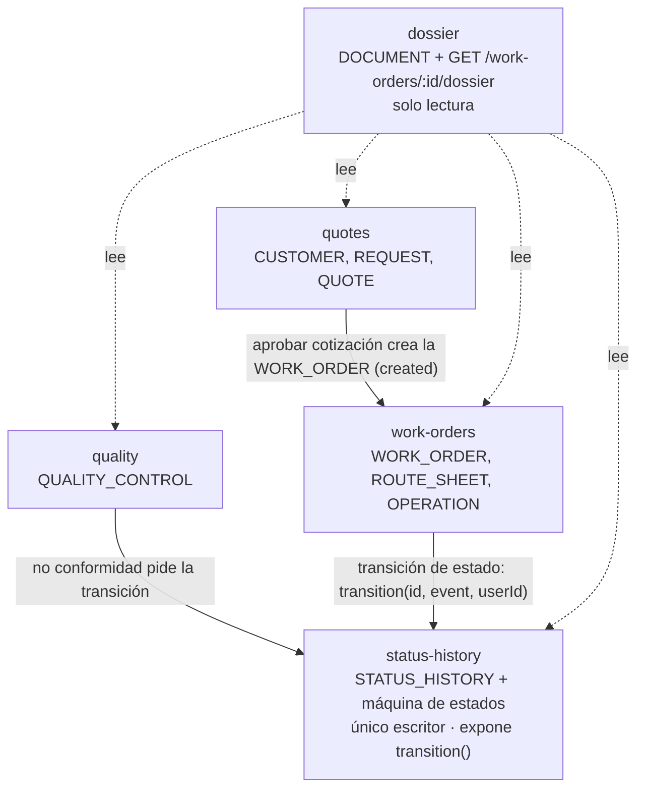

# ADR-0005: Organización del backend en módulos de feature de NestJS

**Estado:** Aceptada
**Fecha:** 2026-09-05
**Deciders:** Backend

## Contexto

El modelo de datos ya define diez entidades: la cadena principal
`CUSTOMER` → `REQUEST` → `QUOTE` → `WORK_ORDER` → `ROUTE_SHEET` →
`OPERATION`, más las tablas satélite `QUALITY_CONTROL`, `DOCUMENT` y
`STATUS_HISTORY`, y la entidad de usuario `APP_USER` (ver el ERD en
`docs/architecture.md`). Todavía no hay una decisión sobre cómo se
organiza el código del backend antes de la primera migración (issue de
Semana 1).

Sin un criterio explícito, hay dos riesgos concretos:

1. Que las entidades terminen repartidas en carpetas técnicas planas
   (`controllers/`, `services/`, `repositories/`) sin ningún límite por
   área de negocio, de modo que a los pocos meses cada carpeta es una
   lista larga de archivos sin relación entre sí.
2. Que la escritura en `STATUS_HISTORY` — la tabla que sostiene el
   criterio de éxito del proyecto — se duplique en varios puntos del
   código, sin garantía de que sea siempre append-only ni de que ocurra
   en la misma transacción que el cambio de `WORK_ORDER.status`.

El dominio es acotado: un CRUD sobre diez entidades con **una** máquina
de estados no trivial (la de `WORK_ORDER`, con el ciclo de reproceso
acotado de ADR-0002). No hay reglas que varíen por cliente, ni
integraciones externas, ni consumidores externos de eventos de negocio.
La organización tiene que dar límites claros por área y proteger
`STATUS_HISTORY`, sin agregar más estructura de la que ese dominio pide.

## Decisión

Se organiza el backend en **módulos de feature de NestJS** bajo
`src/modules/`, un módulo por área de negocio, más un módulo dedicado a
la escritura del historial y un módulo de solo lectura para el
expediente.

| Módulo           | Rol                      | Entidades / responsabilidad                                                                                                                               |
| ---------------- | ------------------------ | --------------------------------------------------------------------------------------------------------------------------------------------------------- |
| `work-orders`    | Producción               | `WORK_ORDER`, `ROUTE_SHEET`, `OPERATION` — alta de OT, hoja de ruta, operaciones                                                                          |
| `quotes`         | Comercial                | `CUSTOMER`, `REQUEST`, `QUOTE`                                                                                                                            |
| `quality`        | Calidad                  | `QUALITY_CONTROL` — registro de inspecciones                                                                                                              |
| `status-history` | Trazabilidad (escritura) | `STATUS_HISTORY` + máquina de estados de la OT — **único** módulo con acceso de escritura a `work_order.status` y `status_history`; expone `transition()` |
| `dossier`        | Trazabilidad (lectura)   | `DOCUMENT` + `GET /work-orders/:id/dossier` — read model, solo compone queries                                                                            |
| `users`          | Identidad                | `APP_USER`, autenticación y autorización                                                                                                                  |
| `prisma`         | Infraestructura          | `PrismaModule` global (`PrismaService` inyectable) — sin lógica de negocio                                                                                |



### Cómo se protege `STATUS_HISTORY`

`status-history` es el **único** módulo que importa el repositorio /
acceso Prisma a las tablas `work_order.status` y `status_history`. Expone
un solo método de escritura:

```ts
// status-history.service.ts
transition(workOrderId: string, event: WorkOrderEvent, userId: string): Promise<WorkOrder>
```

`transition()`:

1. Carga la OT y valida que `event` sea una transición legal desde el
   `status` actual, incluida la regla de los 3 reprocesos de ADR-0002.
2. Abre `prisma.$transaction([...])` y, **en la misma transacción**,
   actualiza `work_order.status` e inserta la fila en `status_history`.

Ningún otro módulo escribe `status` ni `status_history` a mano. Los
módulos de feature (`work-orders`, `quotes`, `quality`) inyectan
`StatusHistoryService` y llaman `transition()`. Es una llamada de método
normal: la transacción es visible y el stack trace lineal.

`dossier` puede **leer** `status_history` (es parte del expediente), pero
no tiene acceso de escritura.

## Opciones consideradas

### Opción A: Organización por capa técnica (`controllers/`, `services/`, `repositories/` a la raíz)

**Pros:** setup inicial más simple, patrón familiar.
**Cons:** a medida que crecen las entidades, cada carpeta técnica queda
como una lista plana sin separación por área de negocio; nada impide que
cualquier service escriba directo en `STATUS_HISTORY`, rompiendo el
append-only sin que ningún test lo detecte. Es exactamente el riesgo #1 y
#2 del contexto.

### Opción B: Bounded contexts / DDD táctico

Contextos con capas internas `domain/` · `application/` ·
`infrastructure/` · `interfaces/http/`, aggregates con eventos de
dominio, y un event bus in-process por el que un contexto de trazabilidad
consume los eventos de transición para escribir `STATUS_HISTORY`.

| Dimensión                                                         | Evaluación                                    |
| ----------------------------------------------------------------- | --------------------------------------------- |
| Aislamiento entre áreas de negocio                                | Alto — límites explícitos por diseño          |
| Protección de `STATUS_HISTORY`                                    | Alta — la escritura es un efecto de un evento |
| Ajuste al tamaño del dominio (10 entidades, 1 máquina de estados) | Bajo — mucha estructura para un CRUD acotado  |
| Costo de la indirección por eventos                               | Alto sin contrapartida en el MVP              |

**Pros:** límites de negocio muy explícitos; la escritura de
`STATUS_HISTORY` como efecto de un evento queda garantizada por diseño;
escala bien a varios equipos en paralelo y a consumidores externos de los
eventos.
**Cons decisivos para el MVP:**

- El dominio no lo justifica: un CRUD sobre diez entidades con una sola
  máquina de estados no trivial no necesita capas de dominio separadas ni
  un catálogo de eventos.
- El event bus in-process no desacopla nada real en un monolito de un
  solo deploy: emisor y consumidor viven en el mismo proceso y la misma
  transacción. Reemplazar una llamada de método por `emit` + `listener`
  agrega un salto de indirección y rompe el stack trace lineal, sin
  ganar nada en el alcance actual.
- Un contexto de trazabilidad que solo escucha eventos y hace un `INSERT`
  es un servicio, no un dominio con lógica propia.
- Contradice el criterio de minimalismo que ADR-0003 ya aplicó
  explícitamente ("no separar Planta en Jefe de Planta / Operario") y el
  objetivo de DX de ADR-0004.

### Opción C: Módulos de feature de NestJS — elegida

Un módulo por área de negocio (`work-orders`, `quotes`, `quality`,
`users`), más `status-history` (único escritor del historial) y `dossier`
(read model). Sin capas de dominio / aplicación / infraestructura
internas obligatorias, sin event bus: colaboración por inyección de
dependencias y llamada de método directa.

**Pros:**

- Es la unidad de organización que NestJS ya impone (`@Module`), sin
  estructura extra que inventar ni mantener.
- Da el beneficio que se busca: límites por área de negocio, issues
  asignables por módulo sin pisarse, y `STATUS_HISTORY` con **un único
  escritor** — protección arquitectónica real, no una convención de
  "acordarse de emitir el evento".
- La transición de estado + el insert en `STATUS_HISTORY` viven en un
  `prisma.$transaction` visible dentro de `transition()`; la regla de
  `CLAUDE.md` se traduce directo a esa primitiva, sin listeners.
- Curva de entrada mínima: un módulo de NestJS con su controller, su
  service y su acceso a Prisma.

**Cons:**

- Menos aislamiento formal entre áreas que la Opción B: nada obliga a
  `quotes` a colaborar con `work-orders` por un contrato acotado en vez
  de importar su service entero. Se controla en revisión de PR y
  exportando de cada módulo solo el service que otros necesitan.
- Si aparecen consumidores externos de los eventos de transición, o
  varios equipos trabajando en paralelo sobre áreas distintas, habrá que
  revisitar esta decisión (ver "Cuándo revisar").

## Consecuencias

- El backend se organiza en `src/modules/{work-orders, quotes, quality,
status-history, dossier, users}` + `src/prisma/`, no por capa técnica
  horizontal ni por bounded context.
- **Un único módulo (`status-history`) tiene acceso de escritura a
  `work_order.status` y `status_history`.** Los demás llaman a
  `StatusHistoryService.transition()`. Un test verifica que la transición
  y el insert ocurren en la misma transacción.
- La lógica de qué transición es legal desde qué estado (máquina de
  estados de ADR-0002, con el límite de 3 reprocesos) vive en
  `status-history`, junto a la escritura que protege — no dispersa en
  cada módulo.
- `quality` no tiene estado propio: registra la inspección y, si es no
  conforme, llama `transition(id, WorkOrderEvent.MarkNonconforming,
userId)`. Consistente con el reproceso sobre el mismo `WORK_ORDER` de
  ADR-0002.
- `dossier` es un módulo de solo lectura: compone en una sola respuesta
  request + cotización + OT + `STATUS_HISTORY` completo + documentos +
  hoja de ruta + operaciones + todos los `QUALITY_CONTROL`. No muta nada.
- `users` (identidad) es genérico: los demás módulos lo consultan para
  autorización, no al revés.
- No hay event bus ni catálogo de eventos de dominio que documentar.
- La estructura de carpetas concreta está en `docs/backend-structure.md`.

## Cuándo revisar esta decisión

Volver a evaluar bounded contexts / eventos de dominio si aparece alguno
de estos disparadores — ninguno está en el alcance del MVP:

- Varios equipos o personas trabajando en paralelo sobre áreas de negocio
  distintas, con conflictos frecuentes de merge en los módulos.
- Un consumidor externo de los eventos de transición (integración con el
  ERP de la fábrica, notificaciones, webhook a un tercero).
- La lógica de calidad crece a checklists de inspección configurables por
  tipo de pieza, con reglas propias — ahí `quality` sí gana un aggregate
  con estado.

## Action Items

1. [ ] Reflejar la estructura `src/modules/{...}` en el issue de Semana 1
       "Project setup / primera migración". La estructura de referencia
       concreta está en `docs/backend-structure.md`.
2. [ ] Al implementar `status-history`, agregar el test que verifica que
       `transition()` actualiza `work_order.status` e inserta en
       `status_history` en la misma transacción (rollback conjunto ante
       error).
3. [ ] Comentar esta decisión con el equipo en la reunión de Semana 1.

## Decisiones relacionadas

- ADR-0002: el reproceso de una OT no conforme ocurre sobre el mismo
  `WORK_ORDER` (hasta 3 vueltas), no genera una OT nueva. La validación
  de ese límite vive en `status-history`.
- ADR-0003: `REQUEST` es una entidad propia; en esta organización cae en
  el módulo `quotes`.
- ADR-0004: stack (NestJS + Prisma) sobre el que se implementan estos
  módulos.
