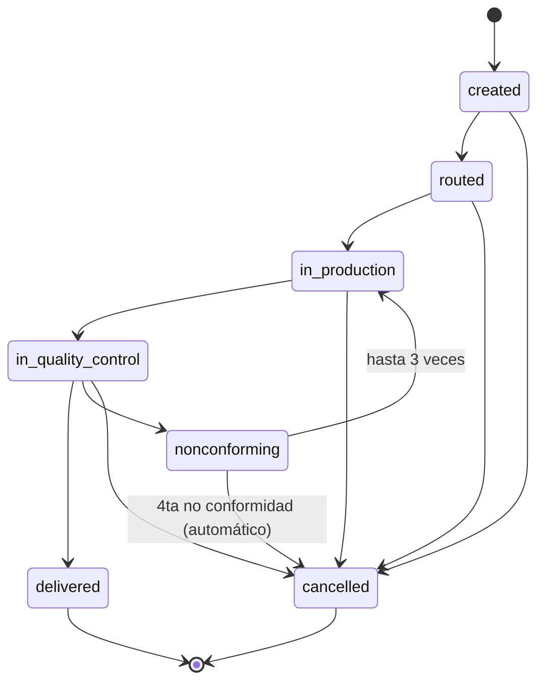

# ADR-0006: Cancelación de una Orden de Trabajo y cierre del ciclo de reproceso agotado

**Estado:** Aceptada
**Fecha:** 2026-09-06
**Deciders:** Team

## Contexto

Dos problemas separados que resultaron ser la misma pieza faltante del
modelo:

1. El diccionario de datos que pasó la analista incluye un estado
   `Cancelada` para la OT. No existe en la máquina de estados de
   `docs/architecture.md` ni fue decidido en ninguna ADR anterior, pero
   el negocio confirma que una OT sí se puede cancelar — por distintos
   motivos, en distintos puntos del flujo.
2. ADR-0002 dejó sin resolver qué pasa cuando se agotan los 3
   reprocesos: dice en prosa que "hay que crear una `WORK_ORDER` nueva
   para refabricar la pieza desde cero", pero no define ninguna
   transición de salida de `nonconforming` para ese caso, no vincula la
   OT nueva con la vieja, y esa OT nueva necesitaría un `quote_id` —lo
   que choca con la cardinalidad 1 a (0 o 1) entre `QUOTE` y
   `WORK_ORDER` que fijó ADR-0001 (una cotización genera como máximo
   una OT).

Ambos problemas se resuelven con lo mismo: un estado terminal de "no se
completó", distinto de `delivered`, con motivo obligatorio. El cierre
del ciclo de reproceso agotado es, en la práctica, uno de los disparadores
de cancelación, así que se deciden juntos en vez de repartir el mismo
estado en dos ADRs.

## Decisión

### Cancelación

Se agrega el estado `cancelled` a `WORK_ORDER.status`. Es alcanzable
desde cualquier estado no terminal — `created`, `routed`,
`in_production`, `in_quality_control`, `nonconforming` — y es terminal:
no tiene transiciones de salida, igual que `delivered`. No es alcanzable
desde `delivered`: una vez entregada, cualquier problema posterior es un
reclamo o una OT nueva, no una cancelación (ver `acceptance-criteria.md`,
Épica 8).

Toda cancelación exige un motivo. Se agrega la columna `reason` (texto,
nullable) en `STATUS_HISTORY`, obligatoria únicamente cuando
`new_status = cancelled`. Va en `STATUS_HISTORY` y no en `WORK_ORDER`
porque el motivo pertenece al evento de la transición, no a la OT en sí
— consistente con que `STATUS_HISTORY` ya es el único lugar que describe
"qué pasó en cada cambio de estado" (ADR-0005).

### Cierre del ciclo de reproceso agotado

Cuando la transición `nonconforming → in_production` se rechaza porque
ya hubo 3 reprocesos, `status-history` fuerza automáticamente la
transición `nonconforming → cancelled` en la misma llamada — la OT no
se queda indefinidamente en `nonconforming` sin salida. El `reason` en
ese caso lo genera el sistema, no un usuario: un texto fijo como
`"reprocess_limit_reached"` (o equivalente), para distinguirlo de una
cancelación manual en los reportes.

Si el cliente quiere reintentar la pieza, se crea una `WORK_ORDER`
nueva. Para no romper la trazabilidad de punta a punta que es el
criterio de éxito del proyecto, esa OT nueva lleva un campo nuevo,
`replaces_work_order_id` (FK a `WORK_ORDER.id`, nullable, autorreferencia),
apuntando a la OT cancelada por límite de reprocesos.

Esto **modifica ADR-0001**: la cardinalidad 1 a (0 o 1) entre `QUOTE` y
`WORK_ORDER` sigue siendo la regla general, pero se agrega una excepción
acotada y explícita — cuando `replaces_work_order_id` no es nulo, la
OT nueva puede reutilizar el mismo `quote_id` que la OT que reemplaza,
porque no hay una renegociación comercial de por medio, es un reintento
interno del mismo trabajo ya cotizado y aprobado. Fuera de ese caso
(`replaces_work_order_id` nulo), la cardinalidad de ADR-0001 se mantiene
sin cambios: una cotización, como máximo, una OT "original".

## Opciones consideradas

### Sobre desde dónde se puede cancelar

#### Opción A: Solo antes de producción (`created`, `routed`)

**Pros:** evita la ambigüedad de qué pasa con material ya cortado u
horas de planta ya invertidas.
**Cons:** no cubre casos reales que el negocio confirmó — un cliente
puede cancelar a mitad de producción, y el cierre del reproceso agotado
ocurre justamente en `nonconforming`, un estado posterior a producción.
Descartada porque no resuelve el problema que originó esta ADR.

#### Opción B: Desde cualquier estado no terminal — elegida

**Pros:** cubre todos los motivos reales relevados (cliente se baja,
error administrativo, material no disponible, fuerza mayor, reproceso
agotado); un solo estado y una sola regla ("nunca desde `delivered`")
en vez de reglas distintas por etapa.
**Cons:** una cancelación en `in_production` o `in_quality_control`
tiene implicancias de costo/facturación por el trabajo ya hecho que este
ADR no resuelve — queda fuera de alcance del backend y es una decisión
de Comercial, no de arquitectura. El `reason` obligatorio deja esa
decisión trazada, no la toma.

### Sobre cómo vincular la OT nueva con la cancelada por reproceso agotado

#### Opción A: Cotización nueva para cada reintento (no toca ADR-0001)

**Pros:** no requiere modificar ninguna ADR anterior.
**Cons:** no refleja la realidad de negocio — no hay una renegociación
de precio ni una nueva solicitud del cliente, es el mismo trabajo. Le
agrega fricción a Comercial (tiene que generar y "aprobar" una
cotización idéntica solo para que el modelo lo permita) y ensucia los
reportes de cotizaciones con filas que no representan ventas nuevas.

#### Opción B: Excepción acotada a ADR-0001 vía `replaces_work_order_id` — elegida

**Pros:** el mismo `quote_id` puede repetirse, pero solo en la cadena de
reintentos de un mismo trabajo, nunca en cotizaciones sin relación entre
sí; la excepción queda documentada explícitamente en vez de ser una
violación silenciosa de ADR-0001; el expediente único puede mostrar la
cadena completa (OT original → cancelada por reproceso agotado → OT de
refabricación) seleccionando por `replaces_work_order_id`.
**Cons:** agrega una columna y una regla de validación más (el código
que crea una `WORK_ORDER` tiene que saber permitir `quote_id` repetido
solo cuando `replaces_work_order_id` no es nulo).

#### Opción C: No vincular las OT en absoluto

**Pros:** cero cambios de esquema.
**Cons:** rompe directamente el criterio de éxito del proyecto — el
historial de una pieza que falló 3 veces y se refabricó quedaría
partido en dos expedientes sin ninguna conexión entre sí. Descartada.

## Consecuencias

- `WORK_ORDER` suma la columna `replaces_work_order_id` (FK a
  `WORK_ORDER.id`, nullable).
- `STATUS_HISTORY` suma la columna `reason` (texto, nullable;
  obligatoria cuando `new_status = cancelled`).
- `status-history` (único módulo que escribe `work_order.status` y
  `STATUS_HISTORY`, ver ADR-0005) es también el único lugar que valida
  que `reason` esté presente al cancelar, y el que dispara la
  cancelación automática por reproceso agotado — nunca queda como una
  transición manual "olvidada".
- El endpoint `GET /work-orders/:id/dossier` (ADR-0005) debe poder
  mostrar, cuando exista, la OT que una determinada OT reemplaza y la
  que la reemplaza a ella — sin esto, una cancelación por reproceso
  agotado deja de ser trazable de punta a punta.
- ADR-0001 queda modificada: la cardinalidad 1 a (0 o 1) entre `QUOTE` y
  `WORK_ORDER` admite la excepción descrita arriba cuando
  `replaces_work_order_id` no es nulo.

## Cómo se cumplen las reglas

| Regla                                                          | Dónde se implementa                                                                                                                |
| -------------------------------------------------------------- | ---------------------------------------------------------------------------------------------------------------------------------- |
| Toda cancelación tiene motivo                                  | `STATUS_HISTORY.reason` obligatorio cuando `new_status = cancelled`, validado en `status-history.service.ts`                       |
| No se cancela una OT entregada                                 | `work-order-state-machine.ts` no admite `delivered → cancelled` como transición válida                                             |
| El reproceso agotado cierra solo, sin quedar en el limbo       | Al rechazar `nonconforming → in_production` por límite de 3, `transition()` aplica `nonconforming → cancelled` en la misma llamada |
| La refabricación queda trazable a la OT que reemplaza          | `replaces_work_order_id` en la OT nueva; `dossier` lo resuelve en la misma respuesta                                               |
| `STATUS_HISTORY` y `work_order.status` en la misma transacción | Sin cambios respecto a ADR-0005 — la cancelación es una transición más dentro de `transition()`                                    |

## Action Items

1. [ ] Validar con Comercial los motivos de cancelación esperados en
       cada etapa (`created`/`routed` vs. `in_production`/
       `in_quality_control`) y si hace falta un catálogo cerrado de
       motivos en vez de texto libre para `reason`.
2. [ ] Definir con Comercial si una cancelación en `in_production` o
       `in_quality_control` dispara algún proceso de facturación
       parcial — fuera de alcance de esta ADR, pero afecta si `reason`
       necesita estructura adicional.
3. [ ] Agregar a `prisma/schema.prisma` las columnas
       `WORK_ORDER.replaces_work_order_id` y `STATUS_HISTORY.reason`
       cuando se implemente ADR-0004 (Prisma).
4. [ ] Actualizar `docs/backend-structure.md` si `status-history`
       necesita un método adicional (ej. `cancel()`) además de
       `transition()`, o si alcanza con pasarle `WorkOrderEvent.Cancel`
       al mismo método.
5. [ ] Reflejar `cancelled` y `replaces_work_order_id` en
       `docs/acceptance-criteria.md` (nueva épica o ajuste a la Épica 8).

## Decisiones relacionadas

- ADR-0001: se modifica — la cardinalidad `QUOTE`:`WORK_ORDER` admite la
  excepción de `quote_id` repetido cuando `replaces_work_order_id` no es
  nulo.
- ADR-0002: se extiende — define qué transición ocurre cuando se agota
  el límite de 3 reprocesos, que ADR-0002 dejaba sin modelar.
- ADR-0005: sin cambios en la organización por módulos; `status-history`
  sigue siendo el único escritor de `STATUS_HISTORY` y `work_order.status`,
  ahora incluyendo `cancelled` y `reason`.
