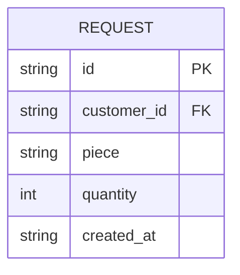

# ADR-0014: `REQUEST.piece` + `REQUEST.quantity` reemplazan `description`

**Estado:** Aceptada
**Fecha:** 2026-09-21
**Deciders:** Backend (a partir de una revisión conjunta del enunciado original)

## Contexto

ADR-0003 dejó explícitamente abierto un pendiente: "Definir si `REQUEST`
necesita campos adicionales (ej. fecha límite deseada) — fuera de
alcance por ahora." `REQUEST` se implementó con un único campo de texto
libre, `description`, para "los datos mínimos del trabajo solicitado".

En la práctica, ese campo nunca fue realmente libre. El formulario de
alta de solicitud (`NewRequestDialog`) siempre pidió **dos** datos
separados — "Pieza" y "Cantidad" — porque son los dos datos concretos
que Comercial carga para cualquier pedido. El frontend los combinaba en
un único string antes de enviarlos (`composeRequestDescription`,
`"<pieza> · x<cantidad>"`) solo porque el backend no tenía dónde
guardarlos por separado. El propio comentario en `schemas.ts` documentaba
la razón: _"REQUEST solo tiene `description` (texto libre) en el
backend -- no hay columnas `piece`/`quantity` propias."_

Releyendo el enunciado original del proyecto
(`docs/reference/enunciado-original.md`), la pregunta que el sistema
tiene que poder responder ante una consulta, un error o una auditoría es
explícita:

> ¿Qué trabajo se realizó, para qué cliente, bajo qué especificaciones,
> con qué material, qué operaciones se realizaron, quién intervino, qué
> controles se efectuaron y qué documentación respalda el proceso?

`quantity` es exactamente ese tipo de dato — estructurado, consultable,
necesario para indicadores de producción ("Falta de indicadores" es uno
de los dolores de negocio listados) — y hoy vive aplastado dentro de un
string sin garantía de formato. No se puede filtrar por él, sumarlo en
un reporte, ni volver a mostrarlo en un formulario de edición sin
parsear texto.

Las "especificaciones técnicas" y el "material" que menciona el
enunciado, en cambio, ya están cubiertos correctamente: el propio
enunciado los lista como **documentación** (planos de ingeniería,
certificados de materia prima), y esa documentación ya se modela como
`DOCUMENT` adjunto a la OT (Épica 4, ADR-0010). No hace falta un campo
de texto adicional para eso — duplicaría lo que el plano o el
certificado adjunto ya dice, y el objeto de esta ADR es exclusivamente
`piece` + `quantity`.

Sobre `QUOTE.amount`: se revisó en el mismo intercambio y se confirma
que está correcto tal cual — la US-03 pide explícitamente "cotización
**económica**", así que un monto único es lo que el negocio necesita
para el MVP. Esta ADR no lo modifica.

## Decisión

`REQUEST` reemplaza `description` (texto libre) por dos columnas
propias:

- `piece` (`String`, `NOT NULL`, hasta 150 caracteres): nombre o
  descripción corta de la pieza pedida.
- `quantity` (`Int`, `NOT NULL`, positivo): cantidad de piezas pedidas.

`composeRequestDescription` se elimina del frontend — ya no hace falta
componer un string para enviarlo, el form (`NewRequestDialog`) manda
`piece` y `quantity` directo al backend.

## Opciones consideradas

### Opción A: Dejar `description` como texto libre

**Pros:** cero cambios de esquema, cero migración.
**Cons:** perpetúa el desajuste ya presente entre el formulario (dos
campos) y el modelo (un string compuesto); `quantity` sigue sin ser
consultable ni agregable para indicadores; cualquier pantalla que
necesite reeditar una solicitud tiene que parsear el separador `" · x"`
a mano, frágil ante cualquier pieza cuyo nombre ya contenga esa
secuencia.

### Opción B: `piece` + `quantity` como columnas propias — elegida

**Pros:**

- Alinea el modelo con lo que la UI ya pedía desde el principio — dos
  campos, no uno.
- `quantity` queda disponible para los indicadores de producción que el
  enunciado pide ("Falta de indicadores" es uno de los dolores de
  negocio explícitos) sin depender de parsear texto.
- Habilita filtrar/buscar solicitudes por pieza de forma confiable.
- No infla el alcance: no se agregan `material` ni `especificaciones`
  como campos nuevos, porque esos datos ya están resueltos como
  `DOCUMENT` adjunto (ADR-0010) — exactamente donde el enunciado los
  ubica.

**Cons:** dos columnas en vez de una; requiere migración con backfill
sobre las filas existentes (ver Consecuencias). Si en algún momento el
negocio pide un tercer dato estructurado (ej. una fecha límite deseada,
ya anotada como pendiente en ADR-0003), se vuelve a evaluar en su propia
ADR — no se anticipa acá.

### Opción C: Agregar `material` y `especificaciones` como campos de texto adicionales

**Descartada.** El enunciado ya resuelve esos datos como documentación
adjunta (planos, certificados de materia prima — Épica 4). Un campo de
texto libre duplicaría esa información sin la garantía de integridad
que sí tiene un archivo adjunto, y no fue pedido por ningún criterio de
aceptación.

## Consecuencias

- **`prisma/schema.prisma`:** `Request.description` se reemplaza por
  `Request.piece` (`String`) y `Request.quantity` (`Int`).
- **Migración con backfill** (`request_piece_and_quantity`): las
  columnas nacen nullable, se completan desde `description` — las filas
  creadas por la UI ya seguían el formato `"<pieza> · x<cantidad>"`, así
  que se parsean con ese separador; las filas que no lo siguen (datos de
  semilla previos a esta ADR) conservan el texto completo como `piece` y
  `quantity` default a `1` — no hay forma de recuperar una cantidad que
  nunca se guardó como valor propio. Recién después se exige `NOT NULL`
  y se borra `description`. Mismo patrón que las migraciones editadas a
  mano de ADR-0001/0006 y ADR-0007/0008 (ver
  `prisma/migrations/README.md`).
- **Backend:** `CreateRequestDto` cambia `description` por `piece` +
  `quantity` (con su propia validación: `@MaxLength(150)`, `@IsInt()`,
  `@IsPositive()`); `RequestsRepository.create`, `RequestEntity` y los
  tests de `requests`/`quotes` se actualizan en consecuencia.
- **Frontend:** `RequestSummary`/`CreateRequestPayload` cambian
  `description` por `piece` + `quantity`; se elimina
  `composeRequestDescription` de `schemas.ts`; `RequestsTable` muestra
  "Pieza" y "Cantidad" como columnas separadas; `QuotesTable` y
  `NewQuoteDialog` componen `"<pieza> · x<cantidad>"` solo para mostrar
  en pantalla, no para persistir.
- **`docs/architecture.md`:** el bloque `REQUEST { ... }` del ERD
  refleja `piece` + `quantity` en vez de `description`.
- `QUOTE.amount` no cambia — se revisó y se confirma correcto tal cual
  (ver Contexto).

## Action Items

1. [x] `prisma/schema.prisma`: `Request.piece` (`String`) +
       `Request.quantity` (`Int`), migración con backfill desde
       `description`.
2. [x] `CreateRequestDto`, `RequestEntity`, `RequestsRepository`,
       `RequestsService`: `description` → `piece` + `quantity`.
3. [x] Tests de `requests`/`quotes` (unit + e2e) actualizados al nuevo
       shape.
4. [x] Frontend: `RequestSummary`, `CreateRequestPayload`,
       `NewRequestDialog`, `RequestsTable`, `QuotesTable`,
       `NewQuoteDialog` — `description` → `piece` + `quantity`; se
       elimina `composeRequestDescription`.
5. [x] `docs/architecture.md`: ERD de `REQUEST` actualizado.

## Decisiones relacionadas

- ADR-0003: `REQUEST` como entidad propia — esta ADR resuelve el action
  item 2 que había quedado pendiente ("Definir si `REQUEST` necesita
  campos adicionales").
- ADR-0010: las especificaciones técnicas y el material del trabajo
  siguen viviendo como `DOCUMENT` adjunto a la OT, no como campos de
  texto en `REQUEST` — esta ADR no lo modifica, lo confirma.
