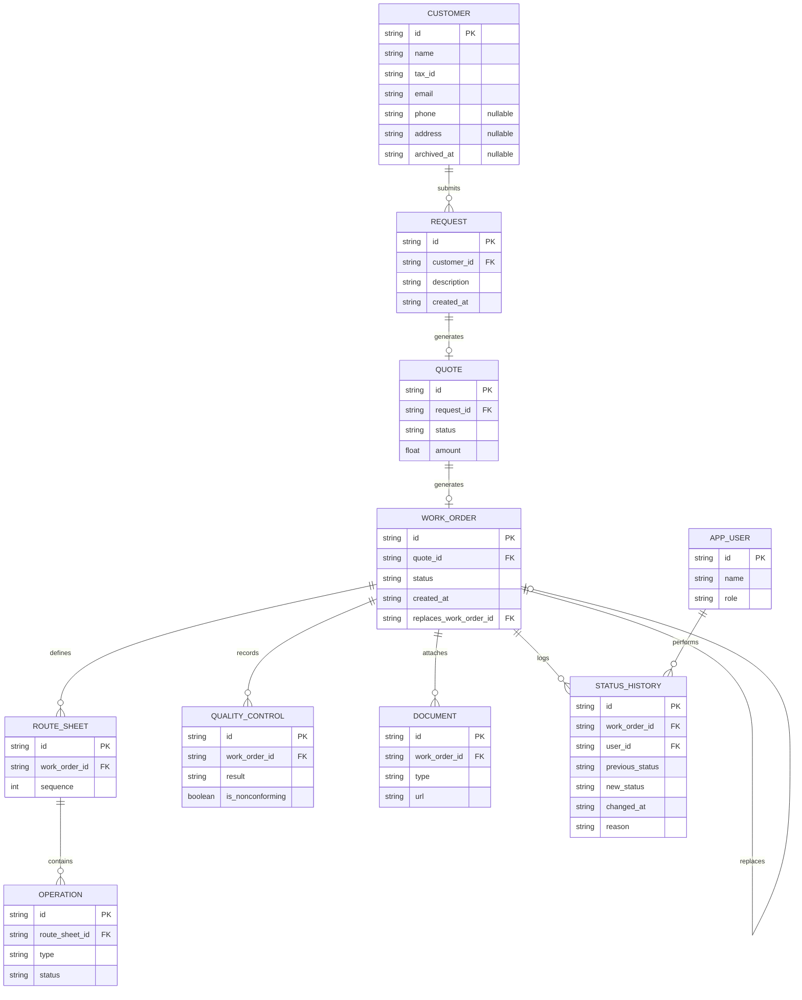

# Arquitectura y modelo de datos — QualityTrack

## Resumen

Este documento describe el modelo de datos relacional y las máquinas de
estados de `QUOTE` y `WORK_ORDER`. Se actualiza a medida que el equipo
de backend toma decisiones — ver `docs/adr/` para el razonamiento detrás
de cada una.

## Modelo de datos (ERD)



GitHub renderiza este bloque como diagrama automáticamente al ver el
archivo en el repo — no hace falta exportar una imagen aparte.

**Nota:** la entidad de usuario se llama `APP_USER` y no `USER` porque
`USER` es palabra reservada en PostgreSQL y en el estándar SQL.
`REQUEST` no tiene `customer_id` duplicado en `QUOTE` — el cliente se
alcanza vía `request_id` (ver ADR-0003).

`WORK_ORDER.replaces_work_order_id` es una autorreferencia opcional:
solo se completa cuando la OT es una refabricación que reemplaza a una
OT cancelada por agotar el límite de reprocesos (ver ADR-0006).

`CUSTOMER.email` es obligatorio (canal de contacto garantizado) pero no
único; el único identificador único del cliente es `tax_id`.
`CUSTOMER.archived_at` marca a un cliente archivado — no se borra, se
archiva (ver ADR-0007 y ADR-0008).

## Por qué STATUS_HISTORY es la tabla central

Sin un registro append-only de cada transición de estado, no es posible
reconstruir el historial completo de una OT desde una pantalla — que es el
criterio de éxito del proyecto. Ninguna transición de estado debe
sobrescribir directamente `WORK_ORDER.status` sin insertar antes una fila
acá, en la misma transacción.

## Máquinas de estados

`QUOTE` y `WORK_ORDER` tienen máquinas de estados propias e independientes.
No comparten valores: una `WORK_ORDER` solo se crea cuando la `QUOTE` ya
fue aprobada (ver ADR-0001), así que un estado `approved` en `WORK_ORDER`
sería redundante — no describiría nada propio de la OT, solo repetiría un
evento que ya quedó registrado en la cotización.

### QUOTE.status

| Valor (código)     | Descripción                                                      |
| ------------------ | ---------------------------------------------------------------- |
| `pending_approval` | Esperando aprobación del cliente                                 |
| `approved`         | Aprobada por el cliente — dispara la creación de la `WORK_ORDER` |
| `rejected`         | Rechazada por el cliente — no genera `WORK_ORDER`                |

### WORK_ORDER.status

El flujo de negocio definido para el MVP:

Solicitud Cliente → Cotización → Aprobación → Orden de Trabajo (OT) →
Hoja de Ruta → Operaciones en Planta → Control de Calidad → Entrega

| Valor (código)       | Descripción                                                                                               |
| -------------------- | --------------------------------------------------------------------------------------------------------- |
| `created`            | OT recién generada a partir de una cotización aprobada, todavía sin hoja de ruta                          |
| `routed`             | Hoja de ruta definida, lista para producción                                                              |
| `in_production`      | Operaciones de planta en curso                                                                            |
| `in_quality_control` | Pieza terminada, pendiente de inspección                                                                  |
| `delivered`          | Control de calidad conforme, ciclo cerrado                                                                |
| `nonconforming`      | Control de calidad detectó una no conformidad                                                             |
| `cancelled`          | OT cancelada — requiere motivo en `STATUS_HISTORY.reason`; terminal, igual que `delivered` (ver ADR-0006) |

**Transiciones válidas:**

```
created → routed
routed → in_production
in_production → in_quality_control
in_quality_control → delivered
in_quality_control → nonconforming
nonconforming → in_production   (hasta 3 veces por OT)
created → cancelled
routed → cancelled
in_production → cancelled
in_quality_control → cancelled
nonconforming → cancelled   (automático, al agotar los 3 reprocesos)
```

`in_production` y `in_quality_control`/`nonconforming` forman un ciclo:
una OT puede pasar por control de calidad más de una vez si hay
reprocesos, con un límite de **3 vueltas** sobre la misma OT. A partir
de la cuarta no conformidad, `nonconforming → in_production` deja de ser
válida: la OT se cancela automáticamente (`cancelled`, con `reason` de
sistema) y, si el cliente quiere reintentar, se crea una `WORK_ORDER`
nueva vinculada vía `replaces_work_order_id` a la OT cancelada. El
conteo de reprocesos se deriva de `STATUS_HISTORY` (filas con
`new_status = nonconforming`). Ver
`docs/adr/0002-reproceso-no-conformidad.md` para el límite de 3 vueltas
y `docs/adr/0006-cancelacion-orden-trabajo.md` para la cancelación y el
cierre del ciclo.

### Cancelación

`cancelled` es alcanzable desde cualquier estado no terminal — nunca
desde `delivered` — y es terminal. Toda transición a `cancelled` exige
`STATUS_HISTORY.reason`: si la cancela una persona, el motivo que
ingresa; si la dispara el sistema por agotar los reprocesos, un motivo
fijo (`reprocess_limit_reached`). Ver
`docs/adr/0006-cancelacion-orden-trabajo.md`.

## Endpoint del expediente único

`GET /work-orders/:id/dossier` es el endpoint más crítico del sistema:
debe devolver en una sola respuesta todo lo necesario para la pantalla
central del MVP — la solicitud y cotización de origen, datos de la OT,
`STATUS_HISTORY` completo, documentos, hoja de ruta, operaciones,
**todos** los controles de calidad registrados (no solo el más
reciente, por los reprocesos de ADR-0002), y la OT que esta reemplaza o
la que la reemplaza a ella, si existe (ver ADR-0006).

## Decisiones relacionadas

Ver `docs/adr/0001-cardinalidad-cotizacion-orden-trabajo.md`,
`docs/adr/0002-reproceso-no-conformidad.md`,
`docs/adr/0003-entidad-request.md`,
`docs/adr/0004-stack-tecnologico.md`,
`docs/adr/0005-organizacion-por-dominios.md` y
`docs/adr/0006-cancelacion-orden-trabajo.md`.
